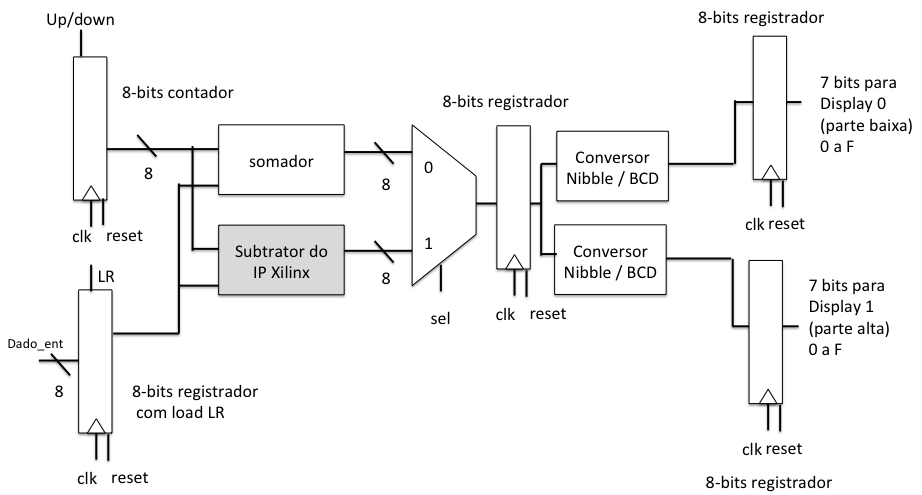

# Digital Systems' First Assignment

## Description

This assingment main proposal is to implement and test using VHDL and Vivado an incrementor/decrementor whose output in two 7-segments display.

To implement this, it was used the following schematic:

## Authors

Wellington Espindula: Main Author  
Fernanda Lima Kastensmidt, Ph.D.: Digital Systems' Professor
